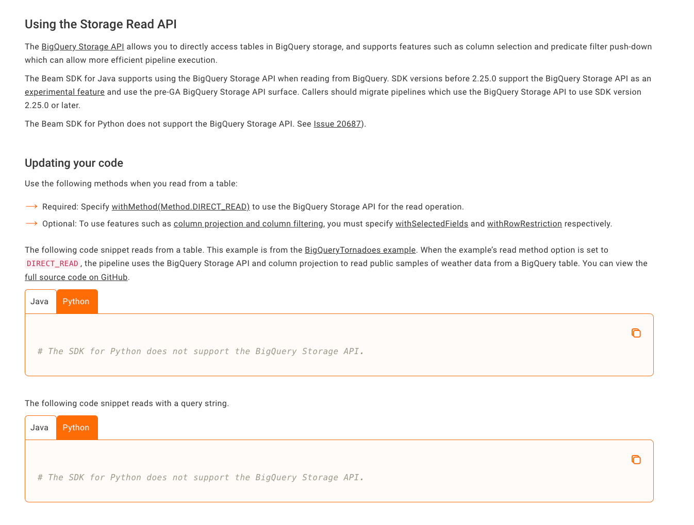
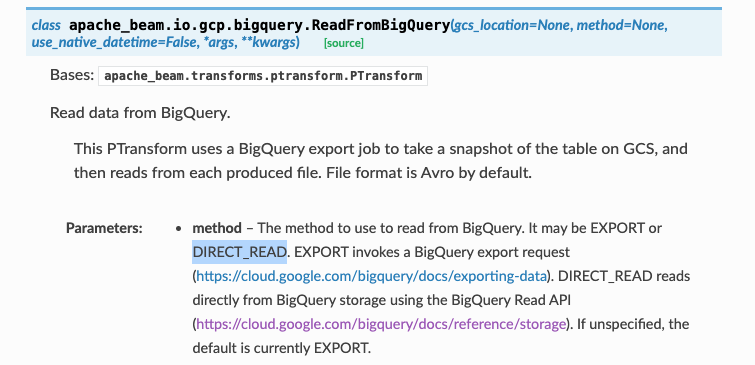
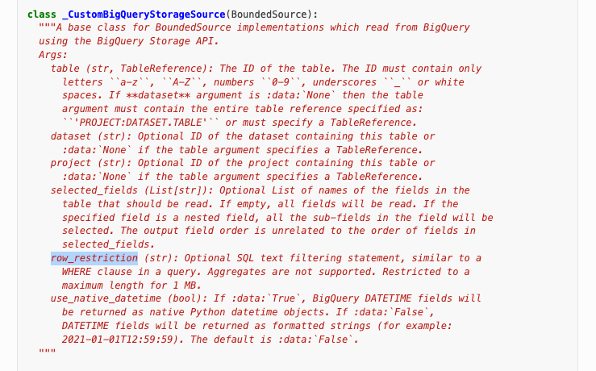

# bigquery-storage-read-api-example
Example using BigQuery Storage Read API. 

The example showcase how to use the Storage Read API to retrieve data directly from BigQuery by retrieving data from the `bigquery-public-data:usa_names.usa_1910_current` public dataset. 

The solution contains two parts
- [main_simple.py](main_simple.py): a simple solution to retrieve data via a single stream
- [main_beam.py](main_beam.py): a distributed solution using beam to process the data in a distributed way

## How to run
### Simple solution
```
pip install google-cloud-bigquery-storage==2.14.2

python main_simple.py
```

### Beam solution
> Please note that, you cannot directly retrieve data from the public dataset because the process requires the `bigquery.readsessions.create` permission. To try the example, load the data into your own project. 
```
pip install apache-beam[gcp]==2.41.0
export PROJECT_ID=<replace with your gcp project id>

python main_beam.py --project ${PROJECT_ID} --table  ${PROJECT_ID}:bigquery_examples.usa_1910_current
```

## Important Docs
The [Beam doc](https://beam.apache.org/documentation/io/built-in/google-bigquery/) is out of date and suggesting storage api is not supported by python, this is not true. This example is based on the storage read api. 


To configure direct read via the storage API, see the `method` parameter from [ReadFromBigQuery](https://beam.apache.org/releases/pydoc/current/apache_beam.io.gcp.bigquery.html#apache_beam.io.gcp.bigquery.ReadFromBigQuery)


It is possible to filter on the BigQuery table but not clearly documented see the `row_restriction` parameter in class [_CustomBigQueryStorageSource](https://beam.apache.org/releases/pydoc/2.41.0/_modules/apache_beam/io/gcp/bigquery.html)

